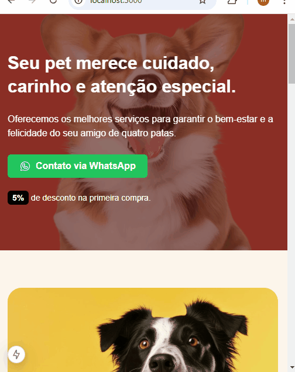

# Projeto DevControle
Estrutura do Projeto PetDev, projeto estudado no curso NextJs do zero ao avançado, ministrado pelo professor Matheus Fraga. <br>
O projeto é uma landing page de uma pet shop que serve como uma ferramenta de marketing digital projetada para direcionar os visitantes a realizar uma ação específica, como se inscrever em uma newsletter, baixar um e-book, ou fazer uma compra. Ela é otimizada para conversão, apresentando informações relevantes de forma clara e atraente, com o objetivo de capturar leads ou aumentar as vendas. Além disso, as landing pages ajudam a medir a eficácia de campanhas publicitárias e a entender melhor o comportamento dos usuários.
<br>
<br>

<br>
<br>

# Login Utilizando conta no Google
O projeto é responsivo como pode ser visualizado no video abaixo 
<br>
<br>

<br>
<br>


# Tecnologias Utilizadas &#128218;

- React
- Typescript
- NextJs
- Tailwind CSS

<br>

# Como Utilizar

```
Clone o projeto:

git clone <url>

Execute a aplicação com o seguinte comando: 

npm run dev

ou 

yarn dev

Abra [http://localhost:3000](http://localhost:3000) com seu navegador para ver o resultado.

Você pode começar a editar a página modificando `app/page.tsx`. A página é atualizada automaticamente conforme você edita o arquivo.

Este projeto usa [`next/font`](https://nextjs.org/docs/basic-features/font-optimization) para otimizar e carregar automaticamente o Inter, uma fonte personalizada do Google.
